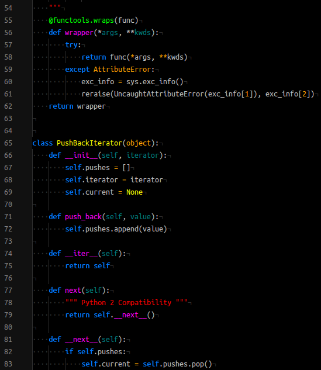

# classic-bright-syntax theme

Classic color syntax (Bright). Nice match with `Atom Dark`.

## Screenshots

### Quick view

### More

Please check [here](screenshots) Or:

*   [bash](screenshots/atom-cbs-dummy-bash.png),
*   [cpp](screenshots/atom-cbs-dummy-cpp.png),
*   [html](screenshots/atom-cbs-dummy-html.png),
*   [java](screenshots/atom-cbs-dummy-java.png),
*   [javascript](screenshots/atom-cbs-dummy-js.png),
*   [php](screenshots/atom-cbs-dummy-php.png),
*   [python](screenshots/atom-cbs-dummy-python.png),
*   [ruby](screenshots/atom-cbs-dummy-ruby.png) and
*   [sql](screenshots/atom-cbs-dummy-sql.png).
